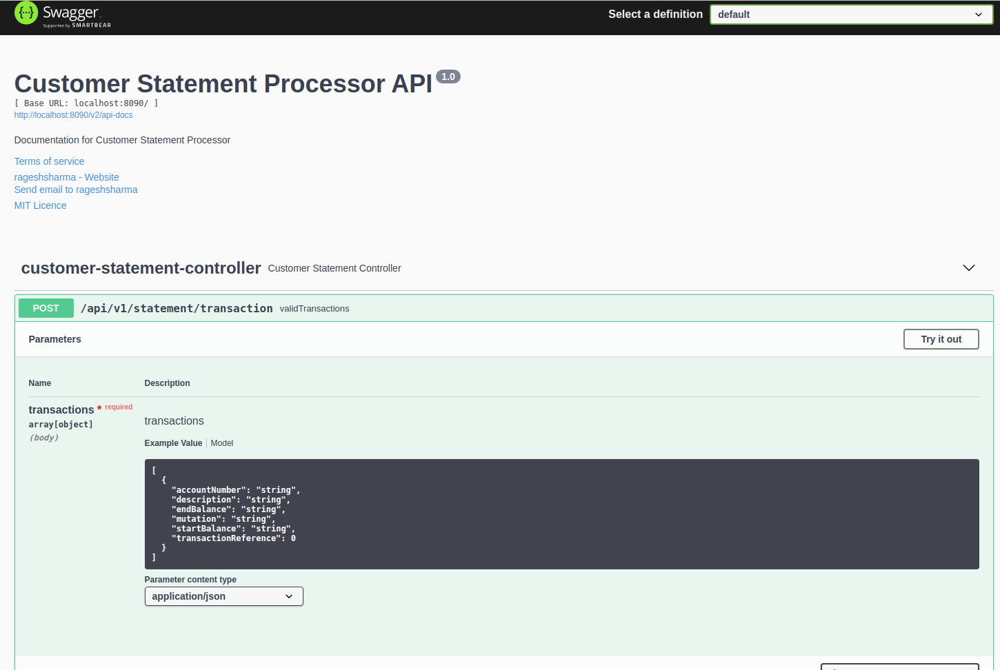
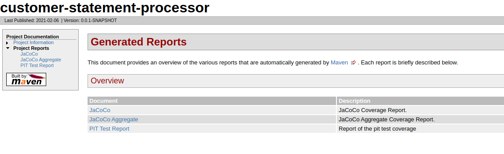
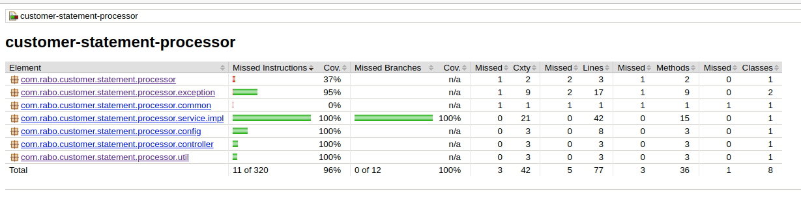
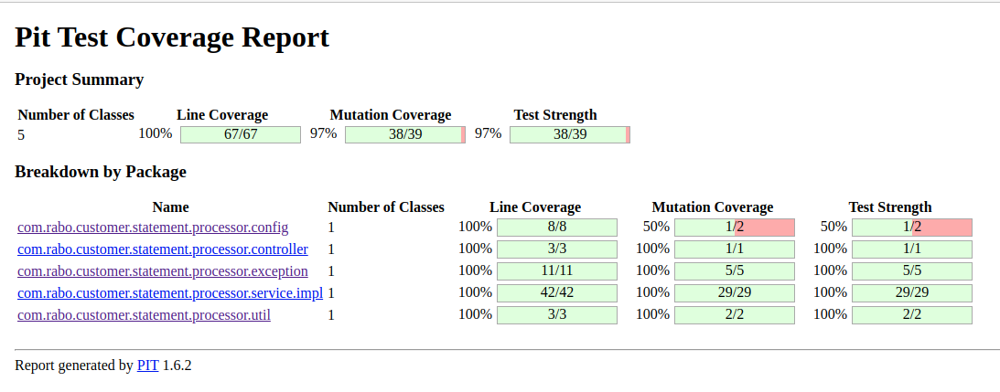

#  Customer Statement Processor API #

In our bank we receive monthly deliveries of customer statement records. This information is delivered in JSON Format.
These records need to be validated.

### Assignment Description

Implement a REST service which receives the customer statement JSON as a POST data, Perform the below validations

1. All transaction references should be unique
2. The end balance needs to be validated ( Start Balance +/- Mutation = End Balance )

### Installation & Execution Steps

**Prerequisties**
* Java 11
* Maven 3.6.3
* Docker 20.10.3 (Only need when you build docker image)

**Dependencies**
* Spring boot 2.4.2 - Spring Framework
* Swagger 3.0.0 - REST API Documentation (Swagger)
* lombok 1.18.16 - Java Library
* Jacoco Plugin 0.8.2 - Unit Test Coverage Plugin
* pitest 1.6.2 - Mutation Testing

### Execution

1. **Checkout the source code**
    ```
      git clone https://github.com/techragesh/customer-statement-processor.git
      cd customer-statement-processor
    ```

2. **Build the application**
    ```
    mvn clean install
    ```

3. **Run the application**
    ```
    mvn spring-boot:run
    ```
4. **Build the docker image**
    ```
    mvn spring-boot:build-image
    ```
5. **Build Test Reports**
    ```
    mvn test site:site
    ```

### Run application through Docker Image

```
docker run -p 8090:8090 --name "customer-statement-processor" customer-statement-processor:0.0.1-SNAPSHOT

```

### REST API Documentation

After running the application and browse the swagger api url

Swagger API Docs:

[http://localhost:8090/v2/api-docs](http://localhost:8090/v2/api-docs)

Swagger API URL:

[http://localhost:8090/swagger-ui/index.html](http://localhost:8080/swagger-ui/index.html)

### Screenshots









### Author
**Ragesh Sharma**

### Happy Coding
